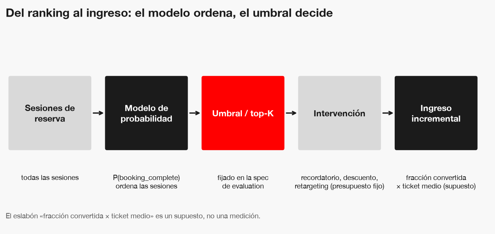

# Enunciado del problema — `conversion-sesion`

*Figura: el modelo ordena sesiones; un umbral (cláusula de `conversion-sesion-evaluation`) decide a
cuáles se interviene; la intervención convierte una fracción, y esa fracción por el ticket medio es
el ingreso.*

| | |
|---|---|
| **Objetivo de negocio** | Ingreso incremental por sesión intervenida, dentro de un presupuesto de intervención fijo |
| **Objetivo de ML** | `P(booking_complete \| atributos de la sesión)`, probabilidad calibrada |
| **Métrica de decisión** | Conversiones capturadas en el top-K del ranking |
| **Métrica de optimización** | Log-loss o PR-AUC; nunca *accuracy* (clase positiva ≈ 15 %) |
| **Ticket medio** | **Supuesto, no medido**: el dataset no trae tarifa. Valor a declarar por Negocio |

## No-objetivos

- **Uplift**: se modela *quién convierte*, no *a quién convertiría la intervención*; no hay tratamiento observado.
- **Ingreso por sesión**: no hay importe ni tarifa, así que el modelo no distingue una conversión cara de una barata.
- **Historial de cliente**: no hay identificador de cliente.
- Serving y monitoreo: quedan para changes posteriores.

## ¿Se resuelve sin ML?

Una regla («intervenir cuando `purchase_lead` es corto») no entrega probabilidad calibrada ni garantías por
segmento, necesarias para un ranking con presupuesto. Se reconsidera si el modelo no la supera en el top-K.
