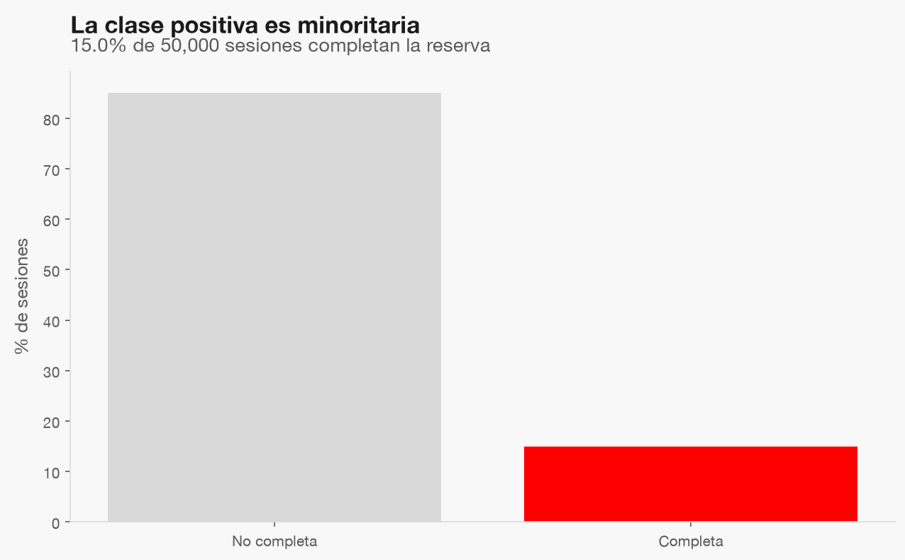
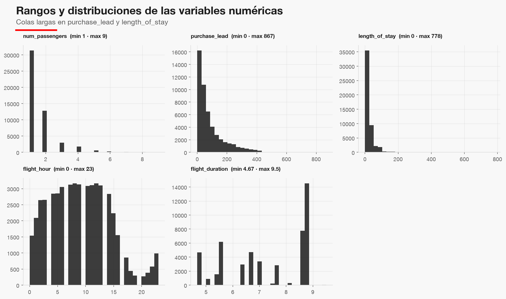
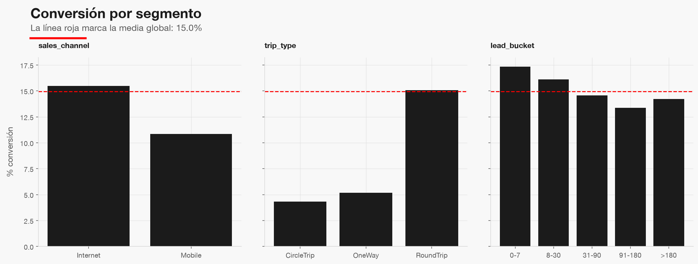

# Perfil de bronze — `customer_booking.csv`

| | |
|---|---|
| Filas · columnas | 50,000 · 15 |
| Nulos | 0 |
| Filas duplicadas exactas | 719 (1.44%) |
| Tasa de positivos | 14.96% |
| Cardinalidad `route` · `booking_origin` | 799 · 104 |

La clase positiva es minoritaria: métricas como *accuracy* engañan; hay que calibrar y evaluar por segmento.

Hay colas largas en `purchase_lead` y `length_of_stay`; los rangos del contrato de datos se fijan con estos máximos.

La conversión cambia con canal, tipo de viaje y antelación: hay segmentos con qué trabajar en `slice-eval`.

## Decisiones

- **Duplicados**: no hay id de sesión, así que las 719 filas idénticas se eliminan en silver (ver fase 03).
- **Fuga de `wants_*`**: ver [wants_leakage.md](wants_leakage.md).
