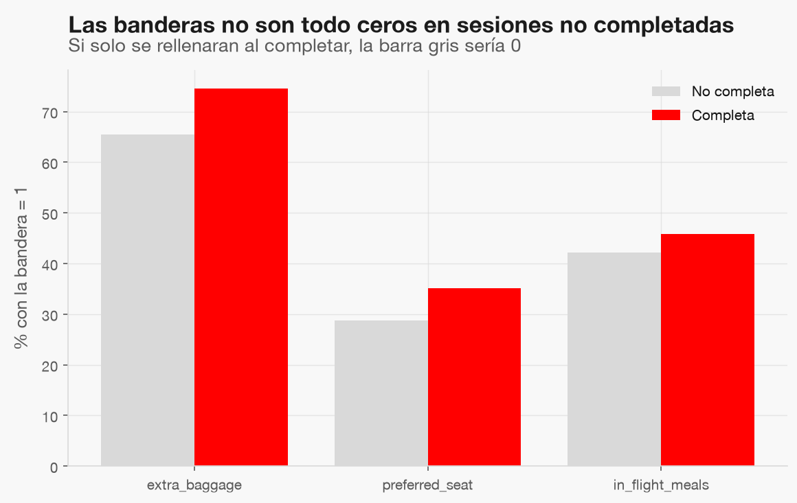

# ¿Filtran las banderas `wants_*` el objetivo?

Pregunta: ¿qué significa `wants_* = 0` en una sesión no completada?

| Bandera | % en 1, no completa | % en 1, completa |
|---|---|---|
| wants_extra_baggage | 65.5 % | 74.5 % |
| wants_preferred_seat | 28.7 % | 35.2 % |
| wants_in_flight_meals | 42.2 % | 45.8 % |

## Veredicto

**Sin fuga por construcción**: las sesiones no completadas tienen banderas en 1, así que se seleccionan durante la sesión. Se conservan como features.

**Supuesto**: la semántica se infiere de los datos, no de una definición del sistema fuente; reconfirmar con la
persona dueña del dato antes de servir. Esta decisión alimenta `conversion-sesion-features`.
