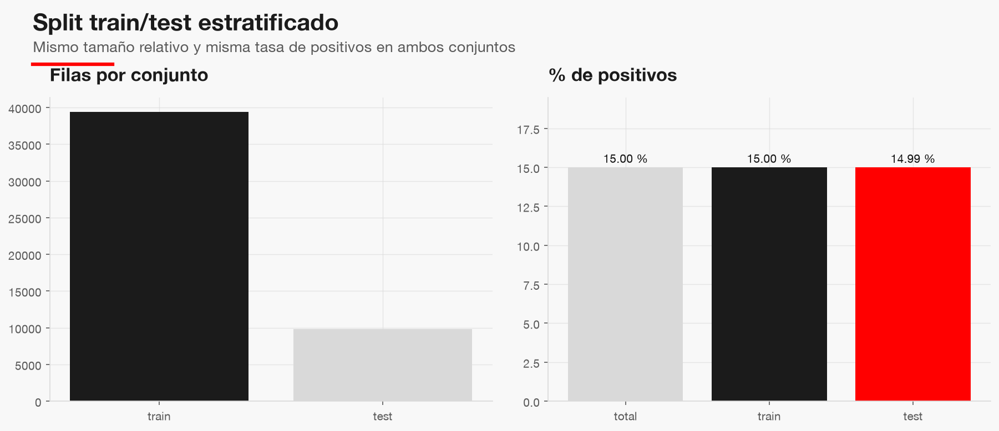
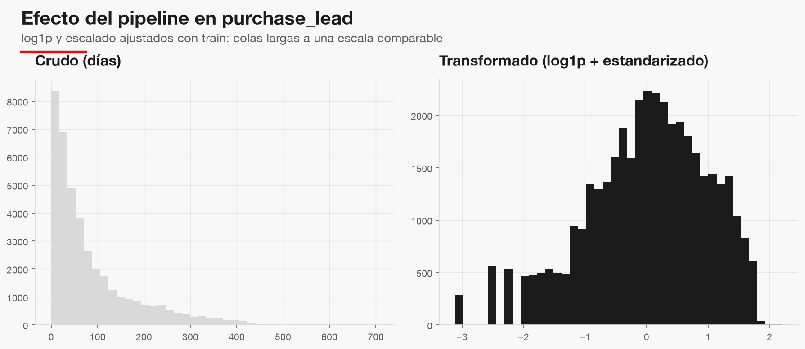

# Preparación de datos

## Orden del proceso

1. **Limpieza y formateo** (bronze → `sessions.parquet`): 719 duplicados exactos eliminados, texto recortado, tipos explícitos.
2. **Split** train/test 80/20, estratificado por `booking_complete`, semilla 42. Va **antes** del feature engineering.
3. **Feature engineering**: el pipeline se **ajusta solo con train** y se aplica a test. Incluye derivadas por fila, `log1p` y escalado
   de numéricas, one-hot de categóricas y target encoding de `route` y `booking_origin`.

Train tiene 39,424 filas (15.00% positivos) y test 9,857 (14.99%): la
estratificación conserva la clase minoritaria en ambos.

## Feature store (`data/silver/`)

| Artefacto | Tamaño |
|---|---|
| `manifest.json` | 2 KB |
| `preprocessing_pipeline.joblib` | 23 KB |
| `sessions.parquet` | 246 KB |
| `test.parquet` | 84 KB |
| `test_features.parquet` | 113 KB |
| `train.parquet` | 292 KB |
| `train_features.parquet` | 401 KB |

- `train.parquet` / `test.parquet`: limpios, columnas originales. Entrada del pipeline en serving.
- `train_features.parquet` / `test_features.parquet`: transformados, con `booking_complete`. Entrada del modelo en las fases 04 y 05.
- `preprocessing_pipeline.joblib`: pipeline ajustado con train. Se define en [`preprocessing.py`](../../code/03-data_preparation/preprocessing.py).
- `manifest.json`: semilla, versión de sklearn, conteos, columnas de entrada y salida, hashes.

`data/gold/` queda vacía: se reserva a datos de inferencia y pruebas de despliegue.

**Límite declarado**: no hay id de cliente ni de sesión, así que el split es por fila.
