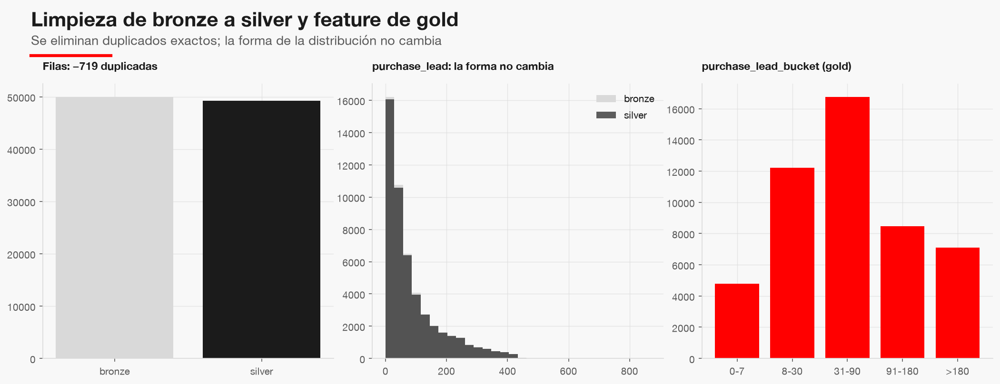

# Preparación de datos

| Capa | Filas | Columnas | Tasa de positivos |
|---|---|---|---|
| bronze | 50,000 | 14 | 14.96% |
| silver | 49,281 | 14 | 15.00% |
| gold | 49,281 | 17 | 15.00% |

Se eliminaron **719** filas duplicadas exactas (sin id de sesión no se distinguen de un registro doble). La
figura muestra que la forma de `purchase_lead` no cambia y que el efecto es de 1.44% de las filas.

Gold añade `purchase_lead_bucket`, `is_weekend_flight` y `extras_count`, todas por fila. Los encodings de
`route` y `booking_origin` se aprenden en modelado, solo sobre entrenamiento.
