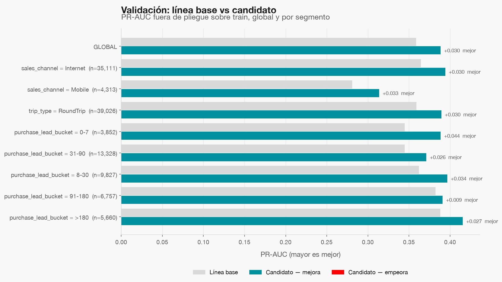
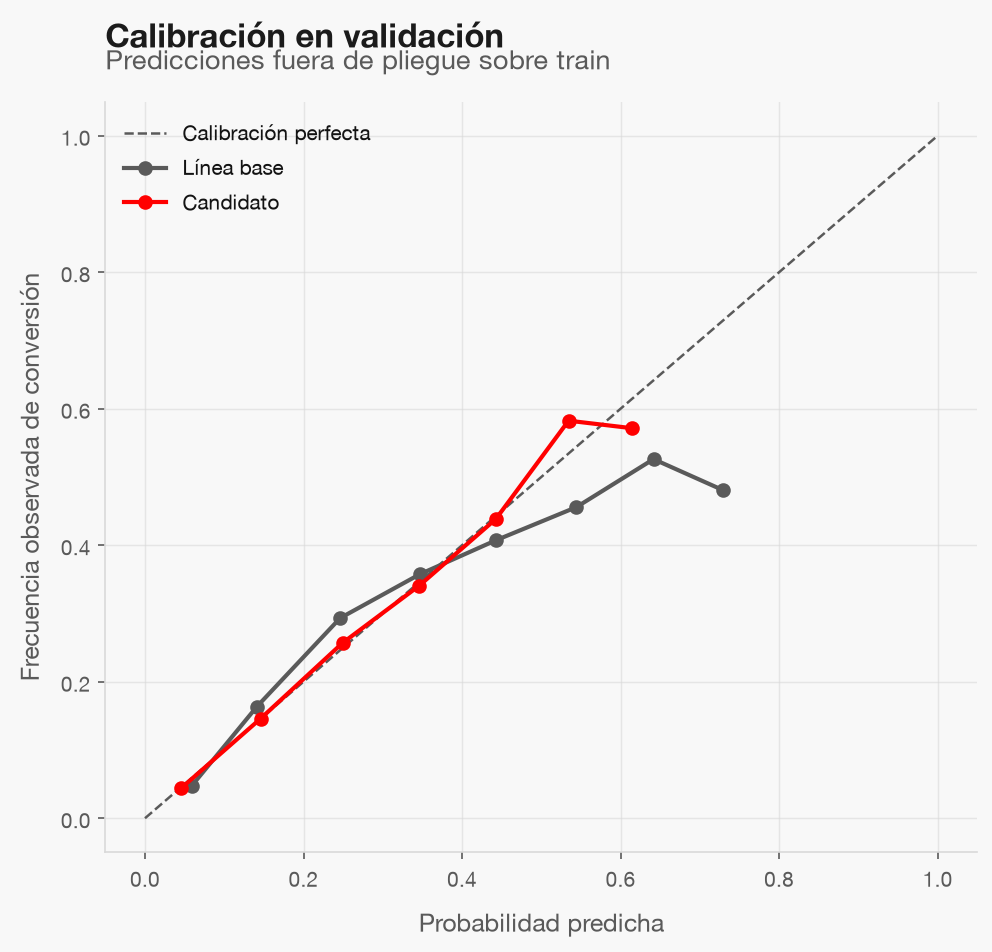

# Modelado

| | Línea base | Candidato |
|---|---|---|
| Modelo | Regresión logística | `HistGradientBoostingClassifier` + calibración sigmoide |
| Run de MLflow | `4c5dc207b456484cb1edd665e813086b` | `245443ec8e7a4546868d036e4b914af8` |

Ambos se registran como **pipeline completo** (preprocesamiento + clasificador) con `signature`, `input_example` y
flavor `sklearn`: la entrada es la sesión cruda. Hiperparámetros fijos, sin búsqueda; semilla 42.

## Validación (5 pliegues sobre train; test no se ha tocado)

| Métrica | Línea base | Candidato |
|---|---|---|
| pr_auc | 0.3587 | 0.3886 |
| log_loss | 0.3597 | 0.3486 |
| roc_auc | 0.7807 | 0.7944 |
| brier | 0.1111 | 0.1079 |
| ece | 0.0221 | 0.0035 |
| captured_conversions_at_k | 0.4948 | 0.5092 |

El candidato se compara con la línea base global y por segmento; los segmentos que empeoran salen en rojo.

**Límite**: las features de train ya llevan el target encoding con validación cruzada del pipeline, así que la
validación es ligeramente optimista; la cifra decisoria es la de test (fase 05).

## Sellado

El candidato quedó sellado en `openspec/changes/conversion-sesion-modeling-evaluation/evidence/seal.json` **antes** de evaluar en test.
