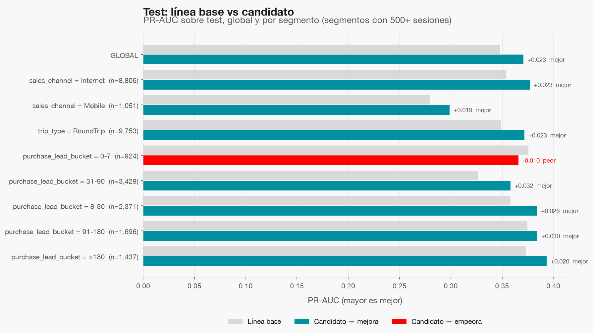
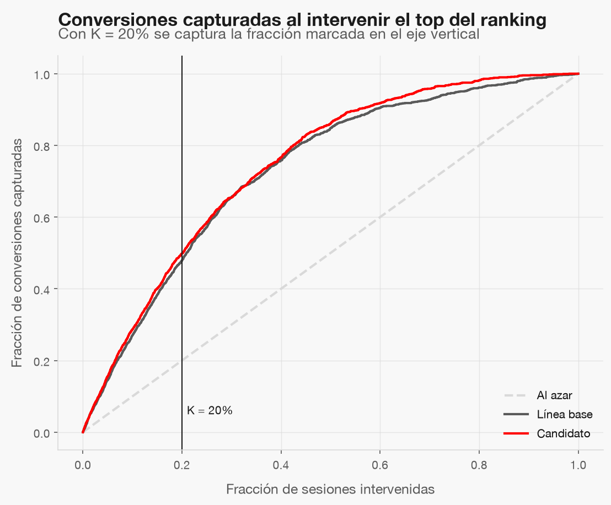
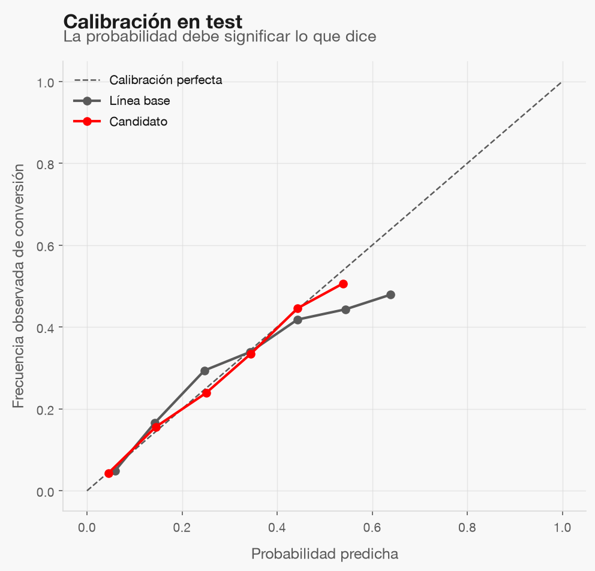

# Evaluación en test

Modelo evaluado: el sellado en `openspec/changes/conversion-sesion-modeling-evaluation/evidence/seal.json` (run `245443ec8e7a4546868d036e4b914af8`).
Test se evaluó **una sola vez**, después del sellado. Regla de decisión: intervenir el top **20%** del ranking.

## Veredicto

**El candidato cumple los umbrales de la spec.**

| Métrica (test) | Línea base | Candidato |
|---|---|---|
| pr_auc | 0.3483 | 0.3708 |
| log_loss | 0.3634 | 0.3516 |
| roc_auc | 0.7728 | 0.7897 |
| brier | 0.1121 | 0.1093 |
| ece | 0.0208 | 0.0063 |
| captured_conversions_at_k | 0.4783 | 0.4986 |

PR-AUC por segmento: los segmentos que empeoran frente a la línea base salen en rojo con el delta impreso.

Con K = 20%, el candidato captura 49.9% de las conversiones y la línea base
47.8%; intervenir al azar capturaría 20%.

ECE del candidato: 0.0063 (umbral 0,05).

## Umbrales incumplidos

- Ninguno.

## Segmentos donde el candidato retrocede

- purchase_lead_bucket = 0-7 (-0.010 PR-AUC): retrocede pero dentro de la tolerancia de 0,02.

## Límites

- Split por fila, sin id de cliente: las cifras son una cota optimista.
- Sin fecha no hay validación temporal.
- El ticket medio sigue siendo un supuesto: estas métricas miden ranking, no ingreso.
