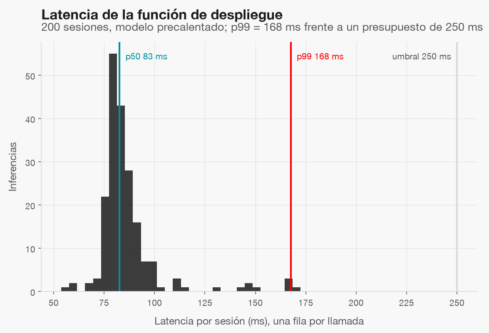

# Despliegue (simulado en local)

No hay nube: el «despliegue» es una función con comando de ejecución que sirve sesiones con una versión del
modelo registrado y guarda cada inferencia en `data/gold/inferences/`.

## Modelo registrado (`conversion-sesion`)

| Versión | Rol | Run de MLflow | Umbral de decisión | Alias |
|---|---|---|---|---|
| v1 | baseline | `4c5dc207b456` | 0.245003 | — |
| v2 | candidate | `245443ec8e7a` | 0.282048 | — |

La v1 (línea base) es el destino de rollback; la v2 (candidato sellado) solo recibe `champion` con comprobante
(`openspec/changes/.../evidence/receipt.json`). El umbral de decisión es el cuantil `1 - K` de las puntuaciones de
test (K = 20 %, de la spec de evaluation).

## Comandos

```bash
# 3 sesiones al azar con el alias champion
python code/06-deploy/predict.py

# otra versión del modelo registrado, o un lote reproducible
python code/06-deploy/predict.py --model-version 1
python code/06-deploy/predict.py --n-rows 2 --seed 7

# tráfico simulado para el monitoreo (marca source = simulation), con desvío desde el lote 220
python code/06-deploy/simulate_traffic.py --model-version 2 --batches 300 --drift-from-batch 220 --reset

# rollback: reapuntar champion a la versión anterior
python code/06-deploy/promote.py --version 1
```

Cada inferencia guarda: `inference_id`, `batch_id`, `timestamp_utc`, `source`, `model_name`, `model_version`,
`model_alias`, `model_run_id`, `prob_conversion`, `intervene`, `decision_threshold`, `latency_ms` (por sesión),
`model_load_ms`, `status`, `reject_reason` y **las entradas** con prefijo `in_`, base del data drift. Una fila con
datos ausentes o inválidos se registra `rejected` sin detener el lote.

## Latencia



Con el modelo precalentado, la mediana es 83 ms y el p99 168 ms por llamada completa (validación,
pipeline y predicción), por debajo del presupuesto de 250 ms. La carga inicial del modelo tarda 4.0 s y
se registra aparte (`model_load_ms`). Es latencia local, no un compromiso de producción.

## Límites

- `mlflow.db` y `mlartifacts/` no se versionan: un clon limpio debe reejecutar la fase 04 y `register_model.py`.
- Sin resultados reales de conversión en línea no se puede medir el desempeño del modelo servido.
