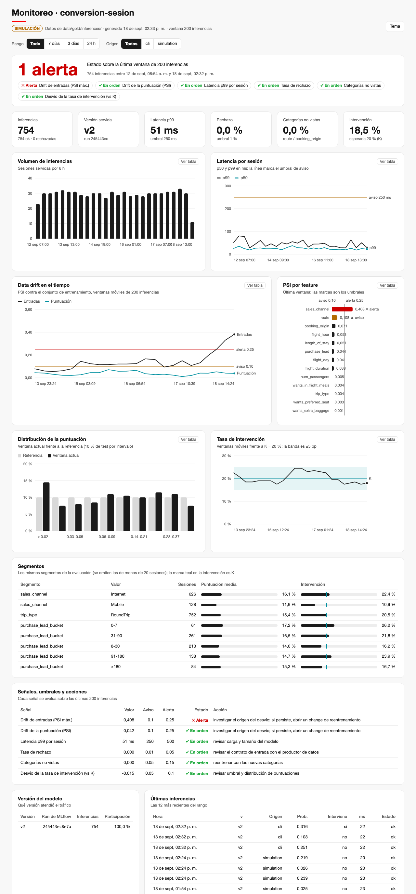
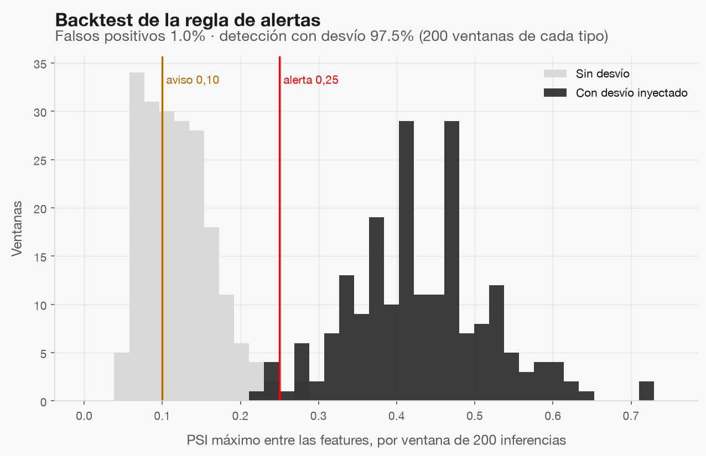

# Monitoreo (simulado en local)

El dashboard es un HTML autocontenido, sin red y con la marca aplicada: [dashboard.html](dashboard.html). Un HTML
abierto desde `file://` no puede leer Parquet, así que la «conexión» con Gold es un paso de construcción que lee
`data/gold/inferences/` y calcula las señales con la misma lógica que los gates de alertas (`drift.py`):

```bash
python code/07_operation_and_monitoring/build_dashboard.py
```



## Señales

| Señal | Ventana | Aviso | Alerta | Acción |
|---|---|---|---|---|
| PSI de feature o de puntuación | 200 inferencias | ≥ 0,10 | ≥ 0,25 | investigar el origen; si persiste, change de reentrenamiento |
| Latencia p99 por sesión | 200 | > 250 ms | > 500 ms | revisar carga y tamaño del modelo |
| Tasa de rechazo | 200 | > 1 % | > 5 % | revisar el contrato de entrada |
| Categorías no vistas | 200 | > 5 % | > 15 % | reentrenar con las nuevas categorías |
| Tasa de intervención vs K | 200 | ±5 pp | ±10 pp | revisar umbral y puntuaciones |

Con menos de 200 inferencias el estado es «datos insuficientes», no verde. Además: volumen, versión servida,
segmentos (canal, tipo de viaje, tramo de antelación) y las últimas inferencias.

## ¿Las alertas son confiables? Backtest



Sobre ventanas de 200 filas de `train`: **1.0%** de falsas alertas sin desvío (presupuesto 5 %) y
**97.5%** de detección cuando se sobremuestrea `sales_channel = Mobile` cinco veces (mínimo 90 %).
El PSI máximo mediano sin desvío es 0.114, por debajo del aviso: el ruido de muestreo no toca los umbrales.

## Límites

- El dashboard es una vista estática: se refresca reconstruyéndolo.
- El tráfico de la demo es simulado (`source = simulation`); el desvío de la ventana final se inyectó a propósito.
- No hay resultados de conversión en línea: no se monitorea el desempeño del modelo, solo entradas, salidas y operación.
